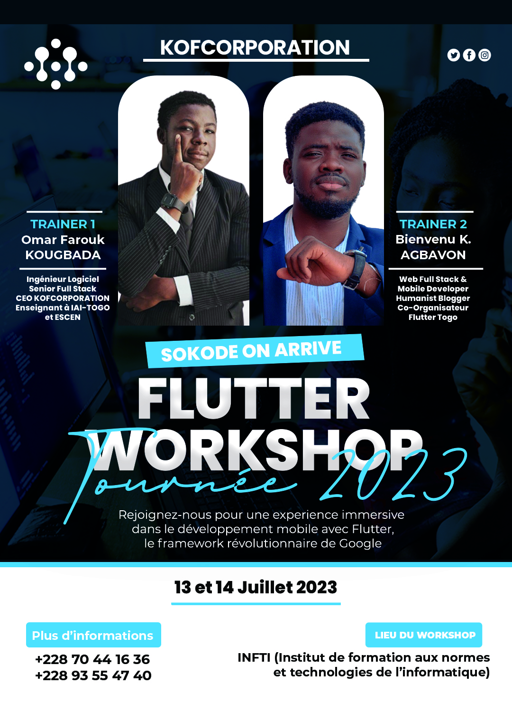

# Flutter Workshop Sokode Codelab - KOFFavor

Application de Gestion de Faveurs.

Le but de ce codelab réalisé à l'IFNTI avec les étudiants de la troisième année est de les initier au développement d'une application mobile avec #Flutter.

En première partie, nous avons réalisé de zéro l'UI de l'application pour mettre en pratique le cours théorique, _Comment réaliser de belles interfaces avec Flutter_.

En seconde partie nous avons ajouté, deux systèmes de gestion d'état (setState, Provider) pour dynamiser notre application.
